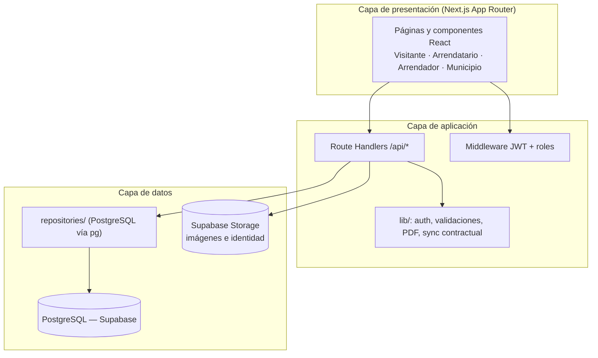
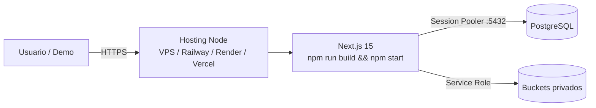

# Arquitectura del software — Manta360

Documento técnico para la rúbrica de **Desarrollo de Sistemas de Información** (PUCE Manabí). Complementa el [README](../README.md) del repositorio.

## Metodología

El equipo trabaja con **Scrum / Kanban** sobre Jira (proyecto `KAN`): épicas, historias y tareas con estados visibles, ramas `feature/KAN-*` y Pull Requests hacia `main`.

**Tablero público del equipo:** [https://manta360.atlassian.net/jira/software/projects/KAN/summary](https://manta360.atlassian.net/jira/software/projects/KAN/summary)

## Vista lógica (capas)

## Vista de despliegue

## Módulos del dominio (RF)

| Módulo | Responsabilidad | Ubicación principal |
|--------|-----------------|---------------------|
| 1. Registro y autenticación | Roles públicos, sesión JWT | `src/app/api/auth/*`, `src/lib/session.ts` |
| 2. Propiedades | CRUD arrendador, catálogo | `src/app/api/properties/*` |
| 3. Contratos | Solicitudes, firmas, PDF, renovación, terminación | `src/app/api/contracts*`, `contract-requests*` |
| 4. Quejas / mantenimiento | Incidencias por contrato activo | `src/app/api/incident-reports/*` |
| 5. Búsqueda | Visitante básico / arrendatario con filtros | `GET /api/properties`, `rental-catalog.tsx` |
| 6. Municipio | Listados, estadísticas, inhabilitación | `src/app/api/admin/*`, `panel/municipio` |

## Decisiones de diseño relevantes

- **Monolito modular** (sin microservicios), alineado al enunciado oficial del proyecto.
- **PostgreSQL directo** con repositorios tipados; `database/BDD.sql` (esquema completo + seed) y `database/schema.sql` (bootstrap sin seed) son la fuente del modelo.
- **Estados contractuales** sincronizan `DISPONIBLE` / `OCUPADO` vía `src/lib/property-contract-state.ts`.
- **Municipio** no se registra por UI: se crea con seed / script (`npm run db:seed-municipio`).
