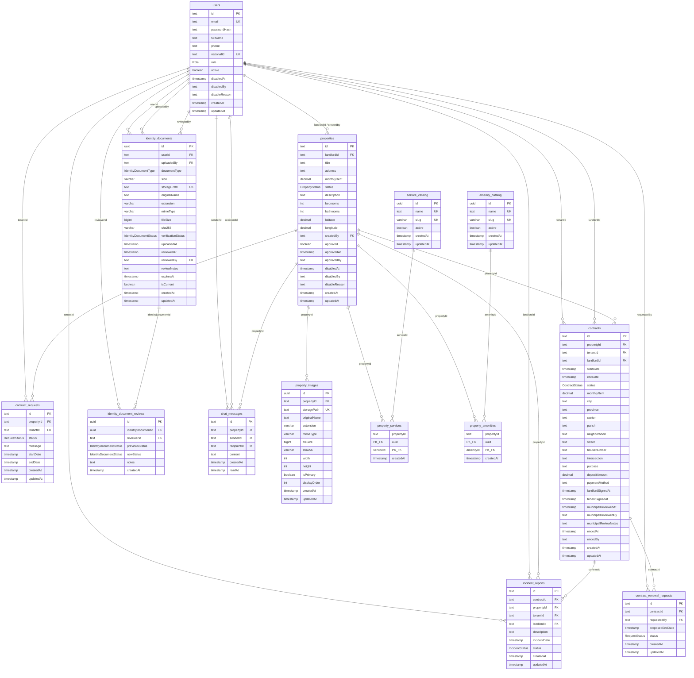

# Modelo de datos (DER / Modelo Relacional) — Manta360

Script oficial de creación + seed: [`database/BDD.sql`](../database/BDD.sql).  
Esquema de bootstrap de aplicación (sin seed): [`database/schema.sql`](../database/schema.sql).

El diagrama y el script cubren **todas** las tablas del sistema (núcleo académico + soporte operativo).

## Inventario completo de tablas

| # | Tabla | Propósito |
|---|--------|-----------|
| 1 | `users` | Usuarios y roles (`Role` enum) |
| 2 | `properties` | Inmuebles del arrendador |
| 3 | `service_catalog` | Catálogo de servicios (agua, luz, internet…) |
| 4 | `amenity_catalog` | Catálogo de comodidades |
| 5 | `property_services` | N:M propiedad ↔ servicio |
| 6 | `property_amenities` | N:M propiedad ↔ comodidad |
| 7 | `property_images` | Fotos de la propiedad (Storage) |
| 8 | `contract_requests` | Solicitudes de arriendo |
| 9 | `contracts` | Contratos y ciclo de vida |
| 10 | `contract_renewal_requests` | Renovaciones |
| 11 | `incident_reports` | Quejas / mantenimiento |
| 12 | `identity_documents` | Documentos de identidad |
| 13 | `identity_document_reviews` | Historial de revisión municipal |
| 14 | `chat_messages` | Mensajería por propiedad |

Enums: `Role`, `PropertyStatus`, `ContractStatus`, `RequestStatus`, `IncidentStatus`, `IdentityDocumentType`, `IdentityDocumentStatus`.

## Diagrama entidad-relación completo (Mermaid)

## Estados clave

**Propiedad (`PropertyStatus`):** `DISPONIBLE` · `OCUPADO` · `MANTENIMIENTO` · `INHABILITADO`

**Contrato (`ContractStatus`):** `PENDIENTE_FIRMA` · `PENDIENTE_MUNICIPIO` · `ACTIVO` · `EN_RENOVACION` · `FINALIZADO` · `RECHAZADO_MUNICIPIO`

**Queja (`IncidentStatus`):** `PENDIENTE` · `EN_PROCESO` · `RESUELTO`

**Solicitud / renovación (`RequestStatus`):** `PENDIENTE` · `APROBADO` · `RECHAZADO`

## Integridad relevante

- Un solo contrato efectivo (`ACTIVO` / `EN_RENOVACION`) por propiedad (índice único parcial).
- Catálogo público: `status = DISPONIBLE` ∧ `approved = true` ∧ arrendador `active`.
- Inhabilitación municipal: propiedad fuera de búsquedas; contratos existentes pueden seguir vigentes.
- `endDate > startDate` en contratos y solicitudes con fechas.
